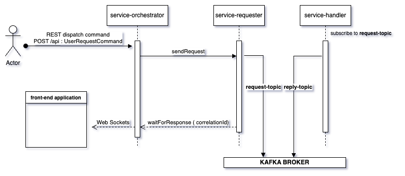

# EDCI

Monorepo EDCI is a monorepo style code repository that contains all the projects for the EDCI project.


1. [Introduction](#introduction)
2. [Business Summary](#business-Summary)
   1. [Application flow](#application-flow)
   2. [Backend run configurations](#backend-run-configurations)
      1. [Backend logging](#backend-logging)
      2. [Backend docker compose file](#backend-docker-compose-file)
      3. [Backend run with docker compose](#backend-run-with-docker-compose)
   3. [Backend services](#backend-services)
      1. [`ServiceOrchestrator` Class Documentation](#serviceorchestrator-class-documentation)
      2. [`ServiceRequester` Class Documentation](#servicerequester-class-documentation)
      3. [`ServiceHandler` Class Documentation](#servicehandler-class-documentation)
   4. [Testing](#testing)
      1. [`KafkaRequestReplyTest` Class Documentation](#kafkarequestreplytest-class-documentation)
3. [Tools](#tools)
   
## Introduction 

Projects :

    Frontend:
    - ngapp - Angular application
    - reactapp - React application

    Backend:
    - bootparent (parent pom) - holds the common dependencies for all the backend projects
        - bootapp - Spring Boot application - kafka example 
        - bootlib - Spring Boot library - library for bootapp

## Business Summary 

By combining Kafka's robust message handling capabilities with WebSocket's real-time communication, the system can deliver a seamless and efficient user experience, making it ideal for modern, data-driven applications.

**Real-Time Communication:** \
&nbsp;&nbsp;&nbsp;&nbsp;&nbsp;The system leverages Apache Kafka and WebSocket to enable real-time communication between the backend and frontend. Kafka acts as a reliable message broker, while WebSocket provides a direct communication channel for instant updates.\
**Decoupled Architecture:** \
&nbsp;&nbsp;&nbsp;&nbsp;&nbsp;By using Kafka, the system decouples the sender and receiver of messages. This allows different services to operate independently, improving scalability and resilience. The backend can process and publish messages to Kafka, which are then consumed by other services or directly sent to the frontend via WebSocket.\
**Interactive User Experience:** \
&nbsp;&nbsp;&nbsp;&nbsp;&nbsp;The integration ensures that users receive updates instantly, enhancing the interactivity and responsiveness of the application. This is particularly useful in scenarios like live dashboards, notifications, or collaborative applications.\
**Scalability and Flexibility:** \
&nbsp;&nbsp;&nbsp;&nbsp;&nbsp;Kafka's distributed nature allows the system to handle large volumes of data and scale horizontally. WebSocket ensures that updates are pushed to clients without the need for polling, reducing latency and server load.\
**Use Cases:** \
&nbsp;&nbsp;&nbsp;&nbsp;&nbsp;This architecture is suitable for applications requiring real-time data streaming, such as logistics tracking, financial trading platforms, or collaborative tools. It provides a robust solution for scenarios where timely data delivery is critical.\

## Application flow:



User Interaction: An actor (user) interacts with the front-end application, typically through a UI.


1. **REST API Call** \
      The front-end application / curl command sends a REST API command request to the service-orchestrator with a UserRequestCommand.

2. **Service Orchestrator** \
   The service-orchestrator processes the incoming request and sends a message to the service-requester.

3. **Service Requester** \
   The service-requester sends the request to a Kafka topic (request-topic).

4. **Kafka Broker** \
   The Kafka broker handles the message distribution. The service-handler subscribes to the request-topic.

5. **Service Handler** \
   The service-handler processes the message from the request-topic and sends a response to the reply-topic.

6. **Response Handling** \
   The service-orchestrator waits for a response on the reply-topic using a correlation ID to match requests and responses.

7. **WebSocket Notification** \
   Once the response is received, the service-orchestrator uses WebSockets to notify the front-end application of the update.

8. **Front-End Update** \
   The front-end application receives the WebSocket message and updates the UI accordingly.


### Backend run configurations

Spring boot profile to run application with:
  - docker
  - test
  - prod

e.g to run the application with docker profile

```angular2html
  nx run bootapp:run --args="-Dspring-boot.run.profiles=local"
```
e.g. to build the application with docker profile

```angular2html
  nx run bootapp:build-image --args="-Dspring.profiles.active=docker"
```

e.g. to skip the test while building the application

```angular2html
  nx run bootapp:build --args="-Dmaven.test.skip=true"
```

### Backend logging

Logging is configured in the application.yml file. The log level can be set for different packages.
Spring logging is set to ERROR and Kafka logging is set to ERROR. The application logging is set to DEBUG.

```angular2html
logging:
  level:
    org:
      # spring logging on error only
      springframework:
        web: ERROR
      # kafka logging on error only
      apache:
        kafka: ERROR
    eu:
      ec:
        empl:
          edci:
            async:
              poc: DEBUG
```

### Backend docker compose file

The backend application can be run with docker compose. The docker compose file is in the tools folder.

Bootapp is the backend application that depends on Kafka. The docker compose file runs Kafka and the backend application.
Bootapp start up script waits for Kafka to be ready before starting the application. Runs with the docker profile. 

```angular2html
    environment:
      - SPRING_PROFILES_ACTIVE=docker
```
application-docker.yml is the configuration file for the docker profile. It overrides the application.yml file when same properties are set in both files.

```angular2html
version: '3'
services:
  zookeeper:
    image: confluentinc/cp-zookeeper:latest
    environment:
      ZOOKEEPER_CLIENT_PORT: 2181

  kafka:
    image: confluentinc/cp-kafka:latest
    depends_on:
      - zookeeper
    ports:
      - "9092:9092"
    environment:
      KAFKA_BROKER_ID: 1
      KAFKA_ZOOKEEPER_CONNECT: zookeeper:2181
      KAFKA_ADVERTISED_LISTENERS: PLAINTEXT://kafka:29092,PLAINTEXT_HOST://localhost:9092
      KAFKA_LISTENER_SECURITY_PROTOCOL_MAP: PLAINTEXT:PLAINTEXT,PLAINTEXT_HOST:PLAINTEXT
      KAFKA_INTER_BROKER_LISTENER_NAME: PLAINTEXT
      KAFKA_LISTENERS: PLAINTEXT://0.0.0.0:29092,PLAINTEXT_HOST://0.0.0.0:9092
      KAFKA_OFFSETS_TOPIC_REPLICATION_FACTOR: 1

  bootapp:
    image: bootapp:0.0.1-SNAPSHOT
    ports:
      - "8080:8080"
    depends_on:
      - kafka
    environment:
      - SPRING_PROFILES_ACTIVE=docker
    command: bash -c "
      echo 'Waiting for Kafka to be ready...' &&
      kafka-topics --bootstrap-server kafka:29092 --list &&
      echo 'Kafka is ready!' &&
      java -jar app.jar"

```

Run the backend application with docker compose

```angular2html
cd tools
docker compose up 
```

## Backend services

### `ServiceOrchestrator` Class Documentation

The `ServiceOrchestrator` class is a Spring service responsible for orchestrating service calls and handling responses. It sends requests, waits for responses, and communicates with clients via WebSocket.

#### Package
`eu.ec.empl.edci.async.poc.service`

#### Annotations
- `@Slf4j`: Provides logging capabilities.
- `@Service`: Marks the class as a Spring service.
- `@AllArgsConstructor`: Generates a constructor with one parameter for each field in the class.

#### Dependencies
- `SimpMessagingTemplate`: Used to send messages to WebSocket clients.
- `ServiceRequester`: Handles sending requests and waiting for responses.

#### Methods

##### `callServiceBAndWaitForResponse`
```java
public String callServiceBAndWaitForResponse(String message, String correlationId)
```
- **Description**: Sends a request and waits for a response. If a response is received within the timeout period, it sends the response to WebSocket clients.
- **Parameters**:
  - `message` (String): The message to be sent.
  - `correlationId` (String): The correlation ID for tracking the request and response.
- **Returns**: The response message.
- **Throws**: `RuntimeException` if there is a timeout or any other error during the request-reply process.
- **Logging**:
  - Logs the sending of the request with the correlation ID.
  - Logs the received response with the correlation ID.
  - Logs errors if a timeout or other exceptions occur.

#### Example Usage
```java
@Service
@AllArgsConstructor
public class ServiceOrchestrator {

  private final SimpMessagingTemplate messagingTemplate;
  private final ServiceRequester requester;

  public String callServiceBAndWaitForResponse(String message, String correlationId) {
    log.info("Sending request with correlationId: {}", correlationId);

    CompletableFuture<String> responseFuture = requester.waitForResponse(correlationId);

    try {
      requester.sendRequest(message, correlationId);
      String response = responseFuture.get(3, TimeUnit.SECONDS);
      log.info("Received response {} for correlationId: {}", response, correlationId);

      messagingTemplate.convertAndSend("/topic", response);

      return response;
    } catch (TimeoutException e) {
      log.error("Timeout waiting for response. CorrelationId: {}", correlationId);
      throw new RuntimeException("Timeout waiting for response", e);
    } catch (Exception e) {
      log.error("Error processing request-reply. CorrelationId: {}", correlationId, e);
      throw new RuntimeException("Error processing request-reply", e);
    }
  }
}
```

### `ServiceRequester` Class Documentation

The `ServiceRequester` class is a Spring service responsible for sending requests to a Kafka topic and handling responses. It uses a `ReplyingKafkaTemplate` to send messages and wait for replies.

#### Package
`eu.ec.empl.edci.async.poc.service`

#### Annotations
- `@Slf4j`: Provides logging capabilities.
- `@Service`: Marks the class as a Spring service.
- `@KafkaListener`: Listens to Kafka topics for incoming messages.

#### Dependencies
- `ReplyingKafkaTemplate<String, String, String>`: Used to send messages and receive replies.
- `Map<String, CompletableFuture<String>>`: Stores pending requests and their corresponding futures.

#### Methods

##### `sendRequest`
```java
public void sendRequest(String message, String correlationId)
```
- **Description**: Sends a request message to the Kafka topic with a correlation ID.
- **Parameters**:
  - `message` (String): The message to be sent.
  - `correlationId` (String): The correlation ID for tracking the request and response.
- **Logging**: Logs the message and correlation ID being processed.

##### `waitForResponse`
```java
public CompletableFuture<String> waitForResponse(String correlationId)
```
- **Description**: Creates a `CompletableFuture` for the response and stores it in the pending requests map.
- **Parameters**:
  - `correlationId` (String): The correlation ID for tracking the request and response.
- **Returns**: A `CompletableFuture<String>` that will be completed when the response is received.

##### `handleResponse`
```java
@KafkaListener(topics = "${spring.kafka.reply-topic}")
public void handleResponse(ConsumerRecord<String, String> record)
```
- **Description**: Handles the response message from the Kafka topic, completes the corresponding future, and removes it from the pending requests map.
- **Parameters**:
  - `record` (ConsumerRecord<String, String>): The Kafka record containing the response message.
- **Logging**: Logs the correlation ID and the response message.

#### Example Usage
```java
@Service
@Slf4j
public class ServiceRequester {

  private final String requestTopic;
  private final ReplyingKafkaTemplate<String, String, String> replyingKafkaTemplate;
  private final Map<String, CompletableFuture<String>> pendingRequests = new ConcurrentHashMap<>();

  public ServiceRequester(@Value("${spring.kafka.request-topic}") String requestTopic,
                          ReplyingKafkaTemplate<String, String, String> replyingKafkaTemplate) {
    this.requestTopic = requestTopic;
    this.replyingKafkaTemplate = replyingKafkaTemplate;
  }

  public void sendRequest(String message, String correlationId) {
    log.info("Service Requester processed: {} , Correlation ID: {}", message, correlationId);
    ProducerRecord<String, String> record = new ProducerRecord<>(requestTopic, message);
    record.headers().add(new RecordHeader("kafka_correlationId", correlationId.getBytes()));
    replyingKafkaTemplate.send(record);
  }

  public CompletableFuture<String> waitForResponse(String correlationId) {
    CompletableFuture<String> future = new CompletableFuture<>();
    pendingRequests.put(correlationId, future);
    return future;
  }

  @KafkaListener(topics = "${spring.kafka.reply-topic}")
  public void handleResponse(ConsumerRecord<String, String> record) {
    String correlationId = new String(record.headers().lastHeader("kafka_correlationId").value());
    CompletableFuture<String> future = pendingRequests.remove(correlationId);
    if (future != null) {
      future.complete(record.value());
    }
  }
}
```

### `ServiceHandler` Class Documentation

The `ServiceHandler` class is a Spring service responsible for processing messages from a Kafka topic and sending responses back to another Kafka topic.

#### Package
`eu.ec.empl.edci.async.poc.service`

#### Annotations
- `@Slf4j`: Provides logging capabilities.
- `@Service`: Marks the class as a Spring service.
- `@KafkaListener`: Listens to Kafka topics for incoming messages.

#### Dependencies
- `KafkaTemplate<String, String>`: Used to send messages to Kafka topics.

#### Methods

##### `handleRequest`
```java
@KafkaListener(topics = "${spring.kafka.request-topic}")
public void handleRequest(ConsumerRecord<String, String> record)
```
- **Description**: Processes the incoming request message from the Kafka topic and sends a response to the reply topic.
- **Parameters**:
  - `record` (ConsumerRecord<String, String>): The Kafka record containing the request message.
- **Logging**: Logs the received request and the correlation ID.

##### `sendResponse`
```java
public void sendResponse(String message, String correlationId)
```
- **Description**: Sends a response message to the Kafka reply topic with a correlation ID.
- **Parameters**:
  - `message` (String): The response message to be sent.
  - `correlationId` (String): The correlation ID for tracking the request and response.
- **Logging**: Logs the response message and correlation ID being sent.

#### Example Usage
```java
@Service
@Slf4j
public class ServiceHandler {

  private final KafkaTemplate<String, String> kafkaTemplate;
  private final String replyTopic;

  public ServiceHandler(KafkaTemplate<String, String> kafkaTemplate, 
                        @Value("${spring.kafka.reply-topic}") String replyTopic) {
    this.kafkaTemplate = kafkaTemplate;
    this.replyTopic = replyTopic;
  }

  @KafkaListener(topics = "${spring.kafka.request-topic}")
  public void handleRequest(ConsumerRecord<String, String> record) {
    String correlationId = new String(record.headers().lastHeader("kafka_correlationId").value());
    String requestMessage = record.value();
    log.info("Received request: {} with correlationId: {}", requestMessage, correlationId);

    // Process the request and generate a response
    String responseMessage = "Processed: " + requestMessage;

    sendResponse(responseMessage, correlationId);
  }

  public void sendResponse(String message, String correlationId) {
    log.info("Sending response: {} with correlationId: {}", message, correlationId);
    ProducerRecord<String, String> record = new ProducerRecord<>(replyTopic, message);
    record.headers().add(new RecordHeader("kafka_correlationId", correlationId.getBytes()));
    kafkaTemplate.send(record);
  }
}
```

### Testing

Integration tests are essential to ensure that the Kafka request-reply functionality works as expected. 
The `KafkaRequestReplyTest` class contains tests for Kafka request-reply functionality using Testcontainers to manage a Kafka instance.

### `KafkaRequestReplyTest` Class Documentation

The `KafkaRequestReplyTest` class contains integration tests for Kafka request-reply functionality using Testcontainers to manage a Kafka instance.

#### Package
`eu.ec.empl.edci.async.poc.service`

#### Annotations
- `@SpringBootTest`: Loads the full application context for integration testing.
- `@Testcontainers`: Enables Testcontainers support.
- `@Slf4j`: Provides logging capabilities.
- `@TestMethodOrder(MethodOrderer.OrderAnnotation.class)`: Specifies the order of test methods.

#### Dependencies
- `KafkaContainer`: Manages a Kafka instance for testing.
- `KafkaAdmin`: Used to create and manage Kafka topics.
- `ServiceOrchestrator`: The service being tested.
- `AdminClient`: Kafka client for administrative operations.
- `KafkaProducer`: Kafka client for producing messages.
- `KafkaConsumer`: Kafka client for consuming messages.

#### Methods

##### `kafkaContainerIsRunning`
```java
@Test
@Order(1)
void kafkaContainerIsRunning()
```
- **Description**: Verifies that the Kafka container is running.
- **Assertions**: Asserts that the Kafka container is running.

##### `canGetBootstrapServers`
```java
@Test
@Order(2)
void canGetBootstrapServers()
```
- **Description**: Verifies that the bootstrap servers can be retrieved from the Kafka container.
- **Assertions**: Asserts that the bootstrap servers are not null and not empty.

##### `canCreateTopic`
```java
@Test
@Order(3)
void canCreateTopic() throws Exception
```
- **Description**: Creates a Kafka topic and verifies its creation.
- **Assertions**: Asserts that the created topic exists in the Kafka cluster.

##### `canProduceAndConsumeMessages`
```java
@Test
@Order(4)
void canProduceAndConsumeMessages() throws Exception
```
- **Description**: Produces a message to a Kafka topic and verifies its consumption.
- **Assertions**: Asserts that the produced message is consumed correctly.

##### `testRequestReply`
```java
@Test
@Order(5)
void testRequestReply() throws Exception
```
- **Description**: Tests the request-reply functionality of the `ServiceOrchestrator`.
- **Assertions**: Asserts that the response starts with the expected processed message and contains the correlation ID.


## Tools

In 'tools' folder, there are some tools that can be used to manage the monorepo.
docker-compose.yml - docker compose file to run the monorepo in a container

Passing arguments to a task
```angular2html
  nx run bootapp:build --args="--arg1=value1 --arg2=value2"
```
